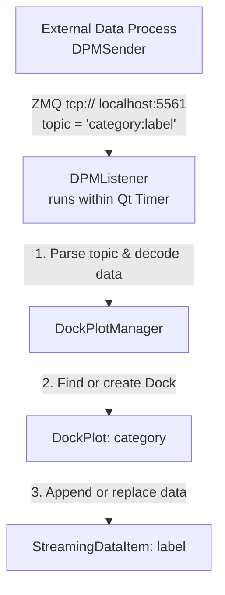

# DPM (Dock Plot Manager) Overview

**DPM** is a specialized Python visualization tool designed to simplify real-time, live-streaming data monitoring in experimental or high-throughput data environments. By building on top of **`pyqtgraph`**'s powerful **`DockArea`** framework, it enables users to view multiple high-frequency data streams within a flexible, reorganizable multi-panel dashboard.

---

### Key Capabilities

1. **Flexible Docking Layouts**: Individual charts reside in panels (docks) that can be dragged, dropped, resized, or tabbed. Layout configurations can be saved to or restored from disk.
2. **Real-Time Data Appending/Replacing**: Designed specifically for live-updating plots with mechanisms to keep the display performance optimal even under heavy load.
3. **Cross-Process Streaming**: Includes built-in ZeroMQ (ZMQ) networking to allow external scripts (e.g., simulation, data acquisition, or hardware control loops) to stream data directly into the visual interface.
4. **Embedded Interactive Console**: Features an integrated Jupyter console embedded directly into the UI, exposing the active manager instance for interactive scripting and data analysis on the fly.

---

### Core Architecture & Components

The application is modularly structured into three distinct functional areas:

#### 1. The GUI & Orchestration Layer (`DPM.py`)
*   **`DockPlotManager`**: The main GUI window coordinator. It initializes the main application, holds the `DockArea`, exposes a control interface for saving/restoring window layouts (via `pickle`), and handles routing incoming data streams to their respective plots.
*   **`DockPlot`**: Subclasses the pyqtgraph `Dock`. Each `DockPlot` hosts a single `PlotWidget` and manages multiple data curves inside that specific panel.
*   **`JupyterConsoleWidget`**: An in-process Qt console that executes in the same context as the GUI, giving users direct Python/NumPy command-line access to the layout and data items.

#### 2. The Data Presentation Layer (`streaming_data_item.py`)
*   **`StreamingDataItem`**: A custom wrapper around `pyqtgraph.PlotDataItem` optimized for streaming data. It operates in two modes:
    *   **Replace Mode**: The incoming dataset completely replaces the old plot curve.
    *   **Append Mode**: Newly arriving points are appended to the existing curve, while older data points are dropped once a configurable buffer limit (`max_samples`) is reached (like a rolling strip chart).
*   **`unpack_data`**: A robust helper utility that handles different incoming data formats (such as 1D arrays, `(x, y)` coordinate tuples, lists, and dictionary mappings) and standardizes them for PyQtGraph.

#### 3. The Communication Layer (`DPM_sender.py` & `DPM_listener.py`)
*   **`DPMSender`**: Instantiated in an external process or hardware script. It sends data packets serialized with `pickle` using a ZeroMQ `PUB` socket. It packages curves under a specific structured topic string (formatted as `category:label`) and supports specifying the plotting `mode` (`'append'`/`'replace'`) and `max_samples` buffers directly in the payload.
*   **`DPMListener`**: Runs within the main application. A `QTimer` periodically polls its ZMQ `SUB` socket. Upon receiving data, it splits the ZMQ topic to extract the target **dock name** (`category`) and the **curve name** (`label`), forwards the coordinates to the manager to update the corresponding plot, and dynamically adjusts the curve's plotting mode and sample limits on the fly.

---

### How the Workflow Operates

1. **Initialization**: The user starts the `DockPlotManager` (often wrapped with a `DPMListener`).
2. **Publishing**: An external sender pushes data point batches calling `.pub_traces("trace_name", y_values, x=x_values)`.
3. **Receiving**: The listener catches the packet, decodes the serialized NumPy arrays, and routes them based on the category.
4. **Drawing**: The specific `StreamingDataItem` adjusts its internal cache buffers and updates the screen seamlessly at a configured polling rate.
5. **Interactive Tweaking**: Layouts can be interactively rearranged and saved via the 'Save Layout' button, storing the exact workspace geometry locally for subsequent sessions.
